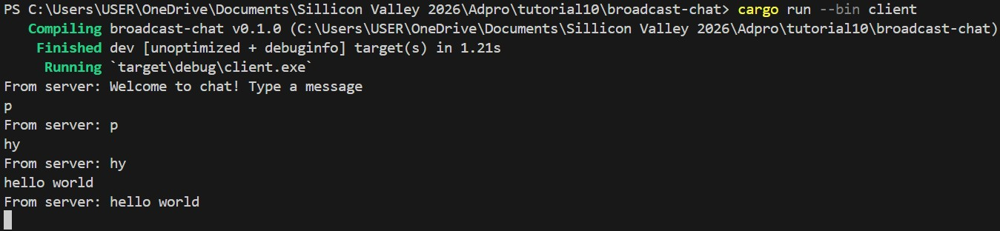
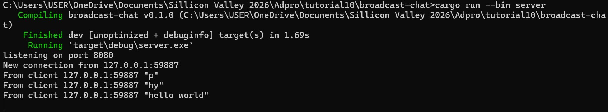
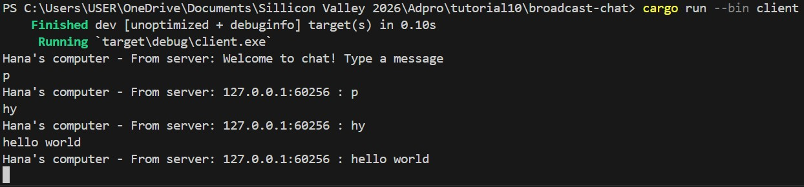
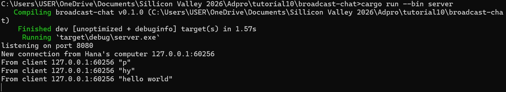

## Reflection

### 2.1 Original code and how it run

  
Setelah dilakukan perintah `cargo run --bin server` dan `cargo run --bin client`, terlihat bahwa setiap chat yang dikirim lewat sisi client juga akan ditampilkan pada sisi server. Setiap client mengetik suatu pesan, string pesan tersebut akan dikirim ke server dan server akan terus mengirimkannya ke semua klien yang terhubung dengannya.

### 2.2 Modifying port

Pada kedua potongan output tersebut, telihat bahwa port telah diubah menjadi 8080 baik pada file `client.rs` maupun pada `server.rs`. Ketika kita melakukan modifikasi port pada kedua sisi, maka program akan berjalan dengan baik sebagaimana semestinya. Namun, jika kita hanya melakukan modifikasi pada satu sisi saja, maka program tidak dapat berjalan dan akan terjadi error sehingga untuk melakukan praktik modifying port, kita harus melakukan modifikasi pada kedua sisi baik server maupun client.

### 2.3 Small changes, add some information to client
  
Potongan output diatas saya dapat dengan melakukan penambahan informasi pada kode `println!("Hana's computer - From server: {}", text);` dalam file client.rs
  
Sementara itu, Potongan output ini saya dapat dengan melakukan penambahan informasi pada kode `println!("New connection from Hana's computer {addr:?}");` dan modifikasi kode `bcast_tx.send(format!("{addr} : {text}"))?;` dalam file server.rs 