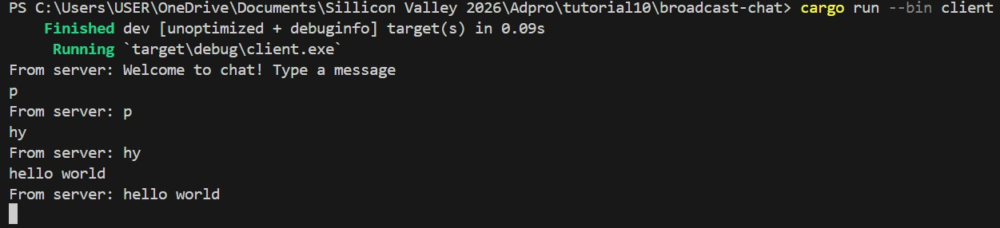
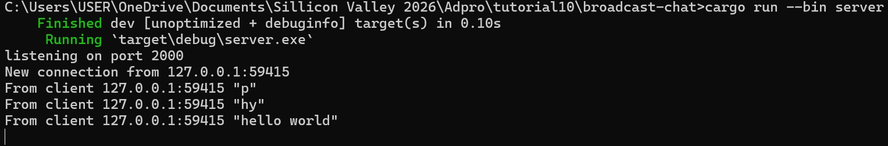

## Reflection

### 2.1 Original code and how it run

  
Setelah dilakukan perintah `cargo run --bin server` dan `cargo run --bin client`, terlihat bahwa setiap chat yang dikirim lewat sisi client juga akan ditampilkan pada sisi server. Setiap client mengetik suatu pesan, string pesan tersebut akan dikirim ke server dan server akan terus mengirimkannya ke semua klien yang terhubung dengannya.